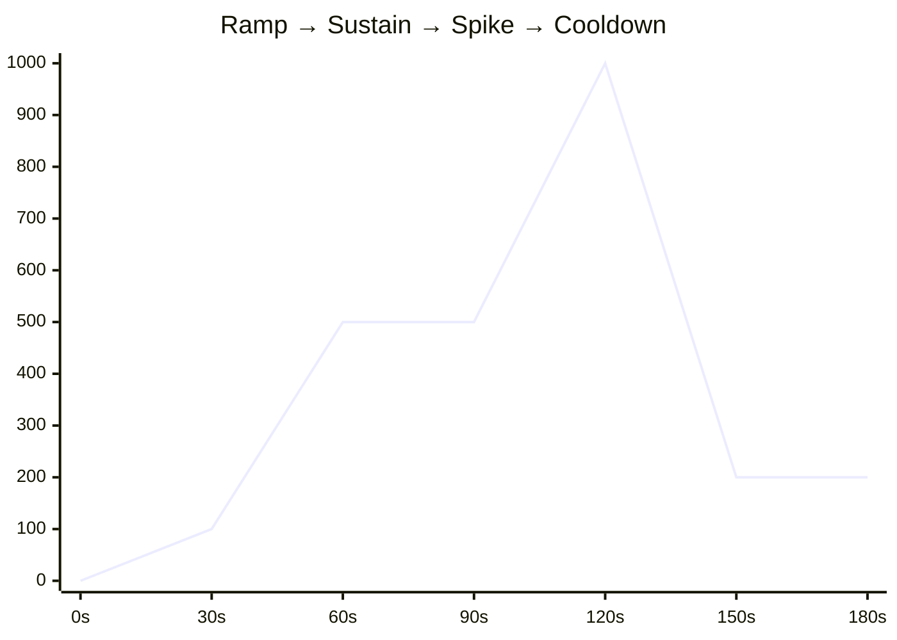

<p align="center">
  <picture>
    <source media="(prefers-color-scheme: dark)" srcset="img/qstorm-banner-dark.svg">
    <source media="(prefers-color-scheme: light)" srcset="img/qstorm-banner-light.svg">
    
  </picture>
</p>

<p align="center">
  Load testing for async message queues — built for engineers who test more than just HTTP.
</p>

<p align="center">
  Inspired by <a href="https://k6.io">k6</a> — same philosophy, different protocol.
</p>

<p align="center">
  <a href="https://github.com/nawafswe/qstorm/actions/workflows/test.yaml"></a>
  <a href="https://github.com/nawafswe/qstorm/actions/workflows/linter.yaml"></a>
  <a href="https://codecov.io/gh/nawafswe/qstorm"></a>
  <a href="https://github.com/nawafswe/qstorm/blob/main/LICENSE"></a>
</p>

---

## Overview

Modern backend systems rely heavily on async workers — services that consume messages from queues and process them in the background. Tools like **k6** and **Locust** are excellent for HTTP load testing, and while they can be extended to work with queues, the setup isn't always straightforward.

**QStorm** aims to bring that same familiar experience — stages, rates, live metrics — to message queues with zero configuration overhead. Define a config, point it at your queue, and run.

QStorm is a **client-side tool** — it runs from your machine or CI pipeline and publishes to the queue. No need to deploy it alongside your workers.

### Features

- **Stage-based load profiles** — define multi-stage tests with different rates and durations
- **Template variables** — `{{uuid}}` and `{{timestamp}}` generate unique values per message
- **Live progress** — real-time terminal output during test execution
- **Accurate metrics** — HDR Histogram for latency percentiles (p50, p75, p90, p99)
- **Graceful shutdown** — `Ctrl+C` stops the test and prints collected results
- **Growing queue support** — PubSub today, Kafka and RabbitMQ coming next

## Queue Support

|                                                | Queue | Status |
|:----------------------------------------------:|---|:---:|
|       | Google Cloud PubSub | ✅ |
|     | Apache Kafka | Planned |
|         | RabbitMQ | Planned |
|    | Apache Pulsar | Planned |
|  | Apache ActiveMQ | Planned |

## Installing

### Prerequisites

- Go 1.26+
- Docker (for running queue emulators locally)

### Build from source

```bash
git clone https://github.com/nawafswe/qstorm.git
cd qstorm
make build
```

## Usage

### 1. Start a queue emulator (for local testing)

```bash
make environment
```

This starts the Google Cloud PubSub emulator via Docker and creates a test topic.

### 2. Configure connection credentials

```bash
make env  # copies .env.sample → .env
```

```env
PUBSUB__EMULATOR_HOST=localhost:8095
PUBSUB__PROJECT_ID=qstorm-project
```

### 3. Create a test config

```json
{
  "QUEUE": {
    "TOPIC": "qstorm-topic",
    "TYPE": "gcp-pubsub",
    "PAYLOAD": "{\"order_id\": \"{{uuid}}\", \"customer_id\": \"{{uuid}}\", \"amount\": 10}",
    "ATTRIBUTES": "{\"EVENT_TIMESTAMP\": \"{{timestamp}}\", \"SOURCE\": \"qstorm\"}"
  },
  "STAGES": [
    { "DURATION": "30s", "RATE": 50 },
    { "DURATION": "60s", "RATE": 200 },
    { "DURATION": "60s", "RATE": 50 }
  ]
}
```

### 4. Run

```bash
# positional argument
./bin/qstorm config.json

# with flags
./bin/qstorm --config config.json --env .env
```

| Flag | Default | Description |
|---|---|---|
| `--config` | _(required)_ | Path to the JSON test config file |
| `--env` | `.env` | Path to the `.env` connection file |

### Example output

```
      ___  ____  _
     / _ \/ ___|| |_ ___  _ __ _ __ ___
    | | | \___ \| __/ _ \| '__| '_ ` _ \
    | |_| |___) | || (_) | |  | | | | | |
     \__\_\____/ \__\___/|_|  |_| |_| |_|

  execution: local
  queue:     gcp-pubsub
  topic:     qstorm-topic
  stages:    3 configured, ~2m30s total
  expected:  ~15000 messages

    → stage 1: 30s @ 50 msg/s
    → stage 2: 1m0s @ 200 msg/s
    → stage 3: 1m0s @ 50 msg/s

  ──────────────────────────────────────────────────────────────────────

     ✓ published......: 14988
     ✗ failed.........: 12

       success_rate...: 99.92%
       error_rate.....: 0.08%

       publish_latency: avg=2.1ms  p50=1.9ms  p75=2.4ms  p90=3.2ms  p99=8.1ms

       duration.......: 2m30.012s

  ──────────────────────────────────────────────────────────────────────
```

## Concepts

### Stages

Stages define how traffic changes over time. Each stage has a **duration** and a **rate** (messages per second). Stages run sequentially — use them to model ramp-ups, sustained load, spikes, and cooldowns.



### Template variables

| Variable | Description | Example |
|---|---|---|
| `{{uuid}}` | Unique UUID per occurrence | `f47ac10b-58cc-4372-a567-0e02b2c3d479` |
| `{{timestamp}}` | Current UTC time (RFC 3339) | `2026-03-23T14:30:00Z` |

Each `{{uuid}}` in a single message resolves to a **different** value.

### Metrics

QStorm collects metrics using [HDR Histogram](https://github.com/HdrHistogram/hdrhistogram-go) for accurate latency percentiles:

- **published / failed** — total message counts
- **success_rate / error_rate** — as percentages
- **publish_latency** — avg, p50, p75, p90, p99
- **duration** — total test time

## Roadmap

- [ ] Apache Kafka support
- [ ] RabbitMQ support
- [ ] Threshold assertions (fail if p99 > Xms or error rate > Y%)
- [ ] Result export (JSON, CSV) for CI/CD integration
- [ ] Custom template functions (`{{rand_int 1 100}}`, `{{rand_string 10}}`)

## License

[Apache License 2.0](LICENSE)
