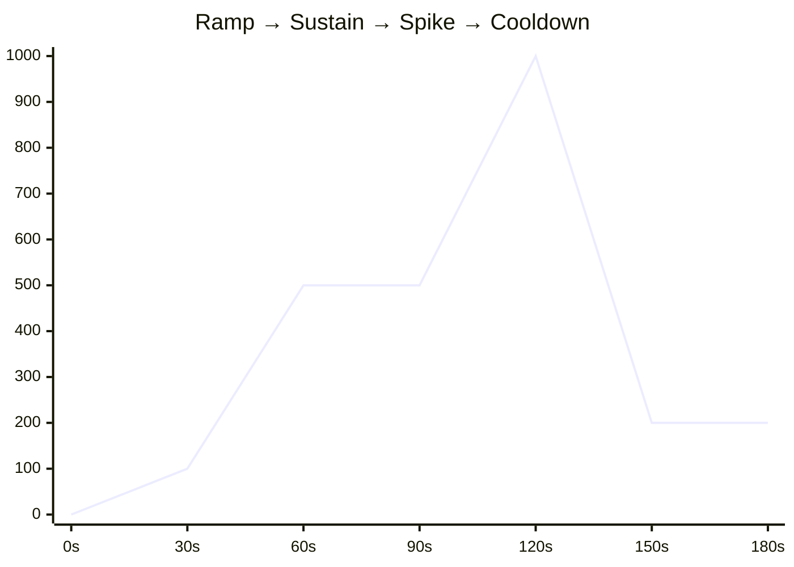
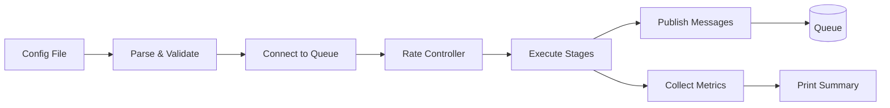

<p align="center">
  <picture>
    <source media="(prefers-color-scheme: dark)" srcset="img/qstorm-banner-dark.svg">
    <source media="(prefers-color-scheme: light)" srcset="img/qstorm-banner-light.svg">
    
  </picture>
</p>

<p align="center">
  Load testing for async message queues — built for engineers who test more than just HTTP.
</p>

<p align="center">
  <a href="#the-problem">Problem</a> · <a href="#what-qstorm-does">Solution</a> · <a href="#quick-start">Quick Start</a> · <a href="#configuration">Config</a> · <a href="#queue-support">Queues</a> · <a href="#roadmap">Roadmap</a>
</p>

---

## The Problem

Modern backend systems rely heavily on async workers — services that consume messages from queues like Google PubSub, Kafka, or RabbitMQ and process them in the background.

When engineers want to load test these workers, they reach for tools like **k6** or **Locust**. These tools are excellent — but they are built for HTTP and gRPC. They have no concept of message queues.

This leaves real questions unanswered:

- How does your worker behave when message volume spikes 3x?
- Do your CPU and memory limits hold under real load?
- Does your HPA (horizontal pod autoscaler) scale as intended?
- Does your circuit breaker trip correctly when a downstream service is slow?
- Does your retry logic work without causing a message storm?
- Does consumer lag recover after a burst — or does it spiral?

Today, most teams either ignore these questions or hack together throwaway publisher scripts before each test. Neither approach is good enough for systems that handle real traffic.

## What QStorm Does

QStorm is a **load testing tool designed specifically for async message queue workers**.

It publishes messages to a queue at a controlled, configurable rate — simulating realistic traffic patterns including gradual ramp-ups, sustained load, and sudden spikes. While the messages flow, it collects meaningful metrics about how the system is responding.

The experience is intentionally familiar to anyone who has used k6 — **stages, rates, and a clean terminal output** — applied to the world of message queues.

Inspired by [k6](https://k6.io) — same philosophy, different protocol.

QStorm is a **client-side tool** — it runs from your machine or CI pipeline and publishes to the queue. No need to deploy it alongside your workers.

### Example Output

```
      ___  ____  _
     / _ \/ ___|| |_ ___  _ __ _ __ ___
    | | | \___ \| __/ _ \| '__| '_ ` _ \
    | |_| |___) | || (_) | |  | | | | | |
     \__\_\____/ \__\___/|_|  |_| |_| |_|

  execution: local
  queue:     gcp-pubsub
  topic:     qstorm-topic
  stages:    3 configured, ~2m30s total
  expected:  ~15000 messages

    → stage 1: 30s @ 50 msg/s
    → stage 2: 1m0s @ 200 msg/s
    → stage 3: 1m0s @ 50 msg/s

  ──────────────────────────────────────────────────────────────────────

     ✓ published......: 14988
     ✗ failed.........: 12

       success_rate...: 99.92%
       error_rate.....: 0.08%

       pub_latency....: avg=2.1ms  p50=1.9ms  p75=2.4ms  p90=3.2ms  p99=8.1ms

       duration.......: 2m30.012s

  ──────────────────────────────────────────────────────────────────────
```

## Quick Start

### Prerequisites

- Go 1.26+
- Docker (for running queue emulators locally)

### 1. Clone and build

```bash
git clone https://github.com/nawafswe/qstorm.git
cd qstorm
make build
```

### 2. Start the PubSub emulator

```bash
make environment
```

This starts the Google Cloud PubSub emulator via Docker and creates a test topic.

### 3. Configure your environment

```bash
make env  # copies .env.sample → .env
```

Edit `.env` with your connection details:

```env
PUBSUB__EMULATOR_HOST=localhost:8095
PUBSUB__PROJECT_ID=qstorm-project
```

### 4. Run a load test

```bash
make run
```

Or directly:

```bash
# positional argument
./bin/qstorm example/gcp_pubsub_test_config.json

# with flags
./bin/qstorm --config example/gcp_pubsub_test_config.json --env .env
```

| Flag | Default | Description |
|---|---|---|
| `--config` | _(required)_ | Path to the JSON test config file |
| `--env` | `.env` | Path to the `.env` connection file |

Press `Ctrl+C` at any time for a graceful shutdown — QStorm will print the summary of whatever was collected.

## Configuration

QStorm uses a JSON config file to define the test and a `.env` file for connection credentials.

### Test config (`config.json`)

```json
{
  "QUEUE": {
    "TOPIC": "qstorm-topic",
    "TYPE": "gcp-pubsub",
    "PAYLOAD": "{\"order_id\": \"{{uuid}}\", \"customer_id\": \"{{uuid}}\", \"amount\": 10}",
    "ATTRIBUTES": "{\"EVENT_TIMESTAMP\": \"{{timestamp}}\", \"SOURCE\": \"qstorm\"}"
  },
  "STAGES": [
    { "DURATION": "30s", "RATE": 50 },
    { "DURATION": "60s", "RATE": 200 },
    { "DURATION": "60s", "RATE": 50 }
  ]
}
```

### Template variables

| Variable | Description | Example output |
|---|---|---|
| `{{uuid}}` | Unique UUID per occurrence | `f47ac10b-58cc-4372-a567-0e02b2c3d479` |
| `{{timestamp}}` | Current UTC time (RFC 3339) | `2026-03-23T14:30:00Z` |

Each `{{uuid}}` in a single message resolves to a **different** value — no duplicates.

### Stage-based load profile

Stages let you model realistic traffic patterns:



## How It Works



### Architecture

QStorm is built around a few core components:

- **Engine** — orchestrates stage execution, controls publish rate via tickers, collects metrics
- **Messenger** — interface-based queue client (swap in PubSub, Kafka, etc.)
- **Metric Collector** — HDR Histogram for accurate latency percentiles, atomic counters for throughput
- **Template Renderer** — replaces `{{uuid}}` and `{{timestamp}}` in payloads per-message
- **Printer** — k6-style terminal output with live progress and post-run summary

## Queue Support

| | Queue | Status |
|---|---|---|
|  | Google Cloud PubSub | ✅ |
|  | Apache Kafka | Planned |
|  | RabbitMQ | Planned |
|  | Apache Pulsar | Planned |
|  | Apache ActiveMQ | Planned |

Adding a new queue requires implementing a single interface:

```go
type Messenger interface {
    Publish(ctx context.Context, topic string, message Message) error
    Connect(ctx context.Context, topic string) error
    Close() error
}
```

## Docker

### Build the image

```bash
make build-docker
```

### Run with Docker Compose

```bash
make environment   # start emulator + create topic
make run           # build and run the load test
```

## Makefile targets

| Target | Description |
|---|---|
| `make build` | Build the binary |
| `make run` | Build and run with example config |
| `make build-docker` | Build the Docker image |
| `make environment` | Start emulator and create PubSub topic |
| `make test` | Run unit tests |
| `make lint` | Run golangci-lint |
| `make fmt` | Format code |
| `make clean` | Remove built binaries |

## Who It's For

- **Backend engineers** who run async workers in production and want confidence in their resource configuration
- **Platform teams** practicing chaos engineering who need to stress test queue consumers
- **Engineers** who want to validate retry logic, circuit breakers, and dead letter queue behavior under real load
- **Anyone** tired of writing throwaway publisher scripts before every load test

## Roadmap

- [ ] Apache Kafka support
- [ ] RabbitMQ support
- [ ] Threshold assertions (fail the test if p99 > Xms or error rate > Y%)
- [ ] Multiple publisher concurrency (parallel goroutine pools)
- [ ] Result export (JSON, CSV) for CI/CD integration
- [ ] Custom template functions (`{{rand_int 1 100}}`, `{{rand_string 10}}`)
- [ ] Config validation with clear error messages
- [ ] Ramp-up within a stage (linear increase from 0 to target rate)
- [ ] Consumer lag monitoring (read queue backlog during test)

## License

[Apache License 2.0](LICENSE)
